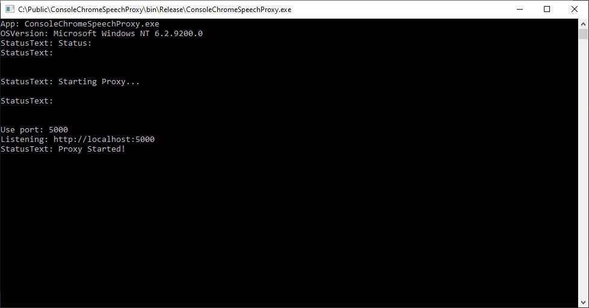
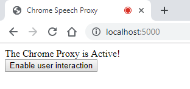

# Chrome Speech Proxy

The Chrome Speech Proxy makes it possible to use the `Speech API` on non-WebGL platforms for `Windows` and `Mac`.

# See Also

The [WebGL For Speech Detection](https://github.com/tgraupmann/UnityWebGLSpeechDetection) package is available in the [Unity Asset Store](https://www.assetstore.unity3d.com/en/#!/content/81076).

The [WebGL For Speech Synthesis](https://github.com/tgraupmann/UnityWebGLSpeechSynthesis) package is available in the [Unity Asset Store](https://www.assetstore.unity3d.com/en/#!/content/81861).

The [WebGL Speech](https://github.com/tgraupmann/UnityWebGLSpeech) package is available in the [Unity Asset Store](https://assetstore.unity.com/packages/tools/audio/webgl-speech-105831).

# Dependencies

* The [Chrome Browser](https://www.google.com/chrome/) must be installed in order to use the proxy.

# Intro

The `Chrome Speech Proxy` is a `Console` application that proxies speech data to the `Unity` engine.
The proxy supports speech detection and speech synthesis.
The proxy requires `admin` or `sudo` rights to host the `HTTP` server.
The `Chrome Browser` and `Unity` communicate with the proxy and the proxy passes data between the `Chrome Browser` and `Unity`.
The `Chrome Browser` supports 120+ [languages](https://cloud.google.com/speech-to-text/docs/languages).

# Releases

* Windows: Download [Chrome Speech Proxy Installer (Windows)](https://github.com/tgraupmann/ConsoleChromeSpeechProxy/releases/tag/1.0)

* Mac: Download [Chrome Speech Proxy (Mac)](https://github.com/tgraupmann/ConsoleChromeSpeechProxy/releases/tag/1.0-Mac)

# Quick Start

* Test your browser for compatibility with the [Chrome Speech Demo](https://www.google.com/intl/en/chrome/demos/speech.html)

* Launch the proxy which should start on the default 5000 port.



* Verify the proxy is running by browsing [localhost:5000](http://localhost:5000)



* Click `Enable user interaction` to enable the text-to-speech API.

<table border="1"><tr><td>
Note: In December of 2018, Chrome added a speech restriction that the speak() method can't be invoked until a web page has some user interaction.

https://www.chromestatus.com/feature/5687444770914304
</td></tr></table>


## Windows

1 Install and launch the proxy which creates a config file so that `Unity` knows where to find the proxy

2 Start `Unity` and connect

3 `Unity` proxy management is now able to `Launch` and `Close` the proxy

4 `Unity` proxy management can open and close `Chrome Proxy Tab` when the proxy is running

5 Close the proxy before changing the port in `Unity`

## Mac

The Mac build uses the `Mono.framework` to launch the proxy.

1 Install the [.Net Core](https://www.microsoft.com/net/core) for Mac

2 Unzip `ConsoleChromeSpeechProxy.zip` to a folder

3 Launch the proxy using the `Mono.framework` in the terminal

```bash
"/Library/Frameworks/Mono.framework/Versions/5.0.1/bin/mono32" "ConsoleChromeSpeechProxy.exe"
```

4 Close the proxy as `Unity` will be able to find and launch the proxy at this point

# FAQ

**User does not see Speech Detection or Speech Synthesis events firing.**

* Completely close all Chrome browser windows and relaunch the browser.

**User does not see Speech Proxy events**

* Close all speech proxy tabs in the Chrome browser. Open a single Chrome Speech Proxy tab. Relaunch the sample.

**The Speech Proxy doesn't launch**

* The default port `5000` may already be in use. Try a port other than the default and relaunch the proxy.

**Detection doesn't seem to be working**

* Only one Proxy window should be open at a time. Also make sure no other browser tabs/windows are using the Microphone. With multiple microphone apps open, the browser doesn't know which one to give focus. 

# Support

Send questions and/or feedback to the support@theylovegames.com email.

Support is also available in Discord, you can reach me at `tgraupmann`.
